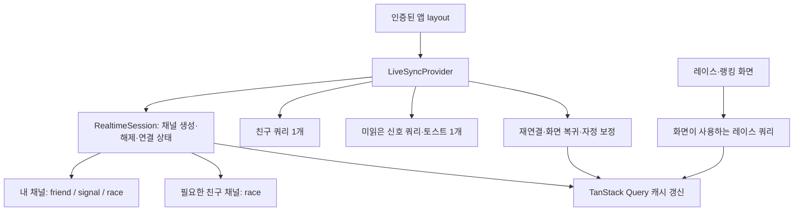

# 조회 효율 개선 설계

날짜: 2026-09-20 · 상태: 제안 · 기준 커밋: `54af08c`

레이스·신호·친구의 반복 조회를 줄이면서 친구 이동 1초 이내 반영, 연결 장애 시 복구, 백그라운드 푸시를 유지한다. 이 문서는 개선안이며, 현재 동작을 설명하는 `docs/features.md`와 ADR은 구현 단계에서 갱신한다.

## 1. 확인한 사실과 확인하지 않은 것

| 항목 | 근거 | 영향 |
| --- | --- | --- |
| 레이스 2초, 신호 5초, 친구 20초 폴링 | `use-race-today.ts`, `use-signal-toasts.ts`, `use-friends.ts` | 세 폴링이 함께 활성화되면 분당 45회 GET. 초기 조회·포커스·화면 전환은 별도 |
| 로컬 Realtime 비활성 | 로컬 환경 파일과 프로세스 환경을 병합해 세 키의 존재 여부만 확인. `SUPABASE_SECRET_KEY` 없음 | 로컬에서는 폴링 유지. 배포 환경의 키·WebSocket 상태는 미확인 |
| 내 채널 중복 소유 | `useRaceRealtime`과 `useFriendRealtime`이 같은 클라이언트에서 `u:{myId}` 구독 | 설치된 supabase-js 2.116.0 재현에서 채널 객체가 같고, 두 번째 구독의 상태 콜백은 실행되지 않음. 한쪽 cleanup이 공용 채널을 제거 |
| 친구 화면 강제 폴링 | `friends-screen.tsx`의 `polling: true` | 연결이 정상이어도 20초 조회 지속 |
| 초기 데이터 즉시 재조회 | 레이스·친구 쿼리의 `staleTime: 0` | QueryObserver 재현에서 마운트 시 1회 요청, `staleTime: 60_000`에서는 0회 |
| 화면보다 넓은 데이터 조회 | 앱 layout과 친구 page가 각각 `getFriendsState` 실행. 전역 친구 요청 감시도 친구·받은 요청·보낸 요청·차단 목록을 모두 읽음 | 이번에는 같은 데이터의 중복 소유부터 제거. API 분할·SQL 최적화는 별도 측정 후 결정 |
| 발송 성공을 읽음으로 처리 | `api/signals/route.ts`가 `broadcast()` 성공 ID를 `markSignalsRead`에 전달하고 푸시 대상에서 제외 | 서버의 브로드캐스트 접수 성공은 수신자의 실제 수신 증명이 아님. 실시간 활성화 전에 수정 필요 |

45회/분은 코드 주기로 계산한 값이다. 스크린샷의 114개 전체 요청에는 RSC·JS·폰트 등이 포함돼 있으므로 이 숫자를 API 폴링 측정값으로 사용하지 않는다. 실서비스의 SQL 수·서버 비용·응답 시간 개선은 아직 측정하지 않았다.

## 2. 선택지와 권장안

| 선택지 | 이점 | 한계 | 결정 |
| --- | --- | --- | --- |
| 폴링 간격만 증가 | 변경이 작음 | 1초 이내 친구 이동 목표를 충족하지 못하고 구독 충돌이 남음 | 제외 |
| 기존 Supabase Realtime의 소유권 통합 + 장애 폴링 + 저빈도 보정 | 기존 기술과 API를 유지하며 정상 상태의 반복 GET 감소 | 연결 생명주기·알림 읽음 확인 수정 필요 | 채택 제안 |
| 별도 WebSocket 서버 또는 통합 조회 API 구축 | 전송·집계를 더 자유롭게 설계 | 운영 대상과 변경 범위 증가. 통합 API도 내부 DB 조회는 남음 | 이번 범위 제외 |

## 3. 구조와 책임

- `(app)/layout.tsx` 안의 클라이언트 `LiveSyncProvider`가 인증 사용자 세션 동안 내 채널을 소유한다. 페이지 전환은 내 채널을 해제하지 않는다. Server Component인 layout과 children 경계는 유지한다.
- 내 채널의 `friend`, `signal`, `race` 리스너를 모두 등록한 뒤 `subscribe()`를 한 번 호출한다. 초기 로그인·로그아웃·계정 교체와 React StrictMode 재실행을 구분한다.
- 채널 생성·해제는 React와 분리한 `RealtimeSession`에서 직렬화한다. 해제 중인 동일 이름 채널을 재사용하지 않도록 `removeChannel()` 완료 후 다음 생성이 진행된다. 이전 세대의 늦은 콜백은 무시한다.
- 친구 ID 변화는 추가·제거된 친구 채널에만 적용한다. 내 채널과 변경 없는 친구 채널은 유지한다.
- 친구 채널은 `/`, `/ranking`, `/friends`에서 유지한다. 홈에는 내 순위, 친구 화면에는 오늘 횟수가 있어 이 화면들도 갱신 대상이다. `/today`, `/collection`에서는 내 채널만 유지한다.
- `ownConnected`는 내 채널, `raceConnected`는 내 채널과 현재 필요한 모든 친구 채널의 연결 성공으로 계산한다. 친구가 없으면 내 채널 연결만으로 준비 완료다. 친구 채널 하나만 실패해도 레이스는 장애 폴링으로 전환한다.
- 친구 데이터는 Provider에서 한 번 조회해 요청 다이얼로그와 친구 화면에 전달한다. 친구 page의 중복 초기 조회와 화면의 독립 폴링을 제거한다.
- 신호 수신·토스트는 Provider에 한 번 둔다. 페이지 전환으로 미읽음 쿼리나 토스트가 다시 생성되지 않게 한다.
- 쿼리 키에 사용자 ID를 포함한다. 예: `["race", "today", userId]`. 세션 종료 시 해당 사용자 쿼리 취소·제거와 채널 해제를 수행한다.

## 4. 조회 정책

다음 숫자를 정책 모듈 한 곳에서 관리한다. 정상 연결 여부와 화면 필요 여부는 별도 조건이다.

| 데이터 | 조회를 소유하는 곳 | 정상 연결 | 연결 중·설정 누락·장애 | `staleTime` |
| --- | --- | --- | --- | --- |
| 레이스 전체 | `/`, `/ranking`의 활성 쿼리 | 60초 보정 | 2초 | 30초 |
| 친구 상태 | Provider, 전체 앱 화면 | 60초 보정 | 20초 | 60초 |
| 미읽은 신호 | Provider, 전체 앱 화면 | 60초 보정 | 5초 | 60초 |

- 최초 진입 시 레이스·친구는 서버 초기 데이터를 이용한다. 미읽은 신호는 한 번 조회한다. 구독 성립 전의 짧은 추가 조회는 별도 집계한다.
- 건강한 연결에서도 서버 브로드캐스트 실패나 놓친 이벤트를 회복하도록 60초 보정을 유지한다. `staleTime`은 마운트 재조회 정책이고 `refetchInterval`과 별개다.
- 숨겨진 문서·오프라인에서는 이 세 쿼리의 신규 조회를 중단한다. 진행 중이던 요청이 완료되는 것은 허용한다. 숨김 자체로 채널을 매번 재생성하지는 않는다.
- 화면 복귀·온라인 복구·실시간 재연결 시 현재 필요한 쿼리를 보정한다. 공통 보정 스케줄러가 100ms 안의 동시 원인을 합치고, 이미 실행 중인 쿼리는 취소·재시작하지 않는다.
- 이 세 쿼리의 자동 `refetchOnWindowFocus`·`refetchOnReconnect`는 끄고 공통 스케줄러가 맡는다. 실제 마운트 시 오래된 데이터 재조회는 유지한다.
- SDK의 WebSocket 재접속 기능을 사용한다. 별도의 무제한 재접속 타이머는 추가하지 않는다. HTTP 401은 해당 세션의 조회를 중지하고 로그인 화면으로 이동하며, 5xx·네트워크 실패는 제한된 재시도를 사용한다.
- KST 자정에는 현재 레이스·친구 상태를 보정한다. 백그라운드에서 자정을 지났으면 복귀 시 처리한다. 이전 날짜의 실시간 이벤트는 적용하지 않는다.

## 5. 캐시와 이벤트 일관성

- 친구의 `race` 이벤트는 레이스 캐시와 친구 목록의 `tapCount`를 직접 갱신한다. 같은 날짜에서 늦게 도착한 낮은 카운트는 반영하지 않는다. 목록에 없는 사용자를 이벤트만으로 친구에 추가하지 않는다.
- 내 탭은 기존 낙관적 갱신과 300ms 배치 저장을 유지한다. 내 `race` 이벤트로 아직 전송되지 않은 탭을 덮지 않는다. 다른 기기의 내 카운트는 보정 조회로 수렴시킨다.
- `friend` 이벤트와 친구 변경 mutation은 친구·활성 레이스 쿼리를 무효화한다. 숨겨진 상태에서는 낡았다고 표시하고 복귀 시 조회한다. 요청 수락·삭제·차단 결과가 조회된 뒤 친구 채널 집합을 변경한다.
- 레이스의 새 서버 초기 값이 더 늦은 KST 날짜이거나 같은 날짜의 정산 완료라면 기존 캐시보다 우선한다. 일반 화면 전환의 오래된 초기 값은 낙관적 카운트를 되돌리지 않는다.
- 정산 후 `/`로 돌아오면 즉시 버튼이 비활성화되어야 한다. `staleTime` 증가 때문에 최대 30초 동안 정산 전 화면이 남는 동작은 허용하지 않는다.
- 현재 `GET /api/signals/unread`는 읽음 처리도 수행한다. 공유 HTTP 캐시·CDN 캐시를 적용하지 않는다. 이번 작업에서 이 GET의 기존 전달 보장 수준까지 변경하지는 않는다.

## 6. 실시간 활성화의 선행 조건: 신호 수신 확인

실시간을 켜는 것이 현재 푸시 전달을 악화시키지 않도록 다음을 같은 배포에 포함한다. 기존 `Signal.readAt`을 쓰므로 스키마 변경은 없다.

1. `POST /api/signals/read`를 추가한다. 인증된 수신자 자신의 신호 ID만 최대 50개까지 읽음 처리하고, 반복 요청은 성공으로 처리한다. 타인의 신호는 변경하지 않는다.
2. 보이는 화면에서 실시간 신호를 토스트에 반영한 클라이언트가 수신 확인을 보낸다. 숨김 상태에서 받은 이벤트는 읽음 확인하지 않고 복귀 시 미읽음 조회로 가져온다.
3. 서버는 브로드캐스트 접수 성공만으로 `readAt`을 채우지 않는다. 푸시 발송 대상에는 모든 생성 신호 ID를 넘기고, 기존 발송 직전 `readAt` 조회로 실제 읽은 신호를 제외한다.
4. 확인 요청은 100ms 배치, 최대 50개, 5xx·네트워크 오류에는 1초·2초 뒤 두 번 재시도한다. 4xx는 재시도하지 않는다. 로그아웃 시 남은 타이머를 정리한다.
5. 토스트 중복 방지는 표시 중인 4초뿐 아니라 기존 미읽음 유효기간인 10분 동안 신호 ID를 보관한다. 같은 ID가 보정 GET으로 다시 와도 재표시하지 않는다. TTL이 지난 항목은 정리한다.

수신 확인과 FCM 발송이 경합하면 인앱·푸시 중복은 여전히 가능하다. 이번 계획은 브로드캐스트 접수만으로 백그라운드 푸시를 누락시키는 문제를 해결한다. 정확히 한 번 전달이나 새로운 지연 작업 큐를 약속하지 않는다. ADR 0006의 유예 설명과 실제 코드 차이도 구현 시 수정한다.

## 7. 성공 기준

| 시나리오 | 합격 기준 |
| --- | --- |
| 정상 연결 후 홈 또는 랭킹을 5분간 그대로 둠 | 세 GET 합계 15회 이하. 초기 연결·사용자 이벤트·화면 복귀 제외. 이론상 기존 225회 대비 약 93% 감소이며 실측 필요 |
| 정상 연결 후 친구·오늘·도감 화면 5분 | `/api/race/today` 요청 0회. 친구·미읽은 신호 GET 합계 10회 이하 |
| 두 친구의 레이스 | 정상 네트워크에서 친구의 탭부터 상대 화면 반영까지 목표 1초 이내. 연타 응답성 100ms 이내 유지 |
| 친구 채널만 실패 | 내 채널이 살아 있어도 레이스 2초 폴링 작동. 복구하면 60초 보정으로 복귀 |
| 전체 실시간 실패·키 누락 | 기존 2초·5초·20초 동작 유지. 실패 상태를 정상 실시간으로 표시하지 않음 |
| 탭 전환·친구 추가·삭제 | 내 채널 1개 유지, 필요한 친구 채널만 증감, 이벤트 핸들러 중복 0개 |
| 숨김·오프라인·복귀 | 숨김·오프라인 중 신규 GET 0회. 복귀 시 필요한 쿼리마다 보정 1회로 동시 복구 원인 병합 |
| 자정·정산·계정 교체 | 이전 날짜 이벤트·다른 계정 캐시 노출 없음. 정산 후 연타 불가 |
| 신호·푸시 | 실시간 수신 신호는 같은 세션에 토스트 1회. 수신자 오프라인에서 브로드캐스트가 성공해도 푸시 후보에 남음 |

수치 측정은 동일 배포 모드·친구 수·네트워크 조건에서 수행한다. Network에서는 세 API 경로를 정확히 필터링하고, GET·신호 확인 POST·탭 POST·RSC·WebSocket 메시지를 별도 집계한다. 요청 감소를 DB 쿼리 감소율이나 비용 감소율로 그대로 환산하지 않는다.

## 8. 범위와 선행 문서

- 런타임 기술은 Next.js 16.3.5, TanStack Query v5, Supabase Realtime, Prisma를 유지한다.
- DB 읽기·쓰기는 Prisma로만 수행한다. Supabase Auth·RLS·PostgREST 도입, 별도 WebSocket 서버, Flutter 변경, 테이블·마이그레이션 변경은 포함하지 않는다.
- 구현 시작 시 `features.md`에 공통 동기화·F2 수신 확인 기준을 추가하고 `decisions/0007-shared-realtime-and-query-reconciliation.md`를 작성한다. 번호는 당시 다음 순번을 재확인한다.
- 실시간 활성화는 코드·회귀 검증 후 수행한다. 환경 변수 값은 출력하거나 저장소에 기록하지 않는다. 배포 환경의 세 키 존재와 WebSocket 상태는 실제 환경에서 확인한다.
- API 경량화, 친구 요청 전용 endpoint, 친구 수별 채널 비용, SQL 실행 계획 분석은 첫 배포의 실측 결과에 따라 후속 범위로 정한다.

## 9. 참고 자료

확인일: 2026-09-20.

- [Supabase channel](https://supabase.com/docs/reference/javascript/channel): 같은 topic은 기존 채널을 반환한다.
- [Supabase Broadcast](https://supabase.com/docs/guides/realtime/broadcast): 전송 확인은 Realtime 서버 접수 확인이며 수신자 표시 확인이 아니다.
- [TanStack Query Important Defaults](https://tanstack.com/query/latest/docs/framework/react/guides/important-defaults): 초기 stale 판정·자동 재조회·폴링 간격의 구분.
- 로컬 Next.js 지침: `app/web/node_modules/next/dist/docs/01-app/01-getting-started/05-server-and-client-components.md`, `01-app/02-guides/testing/vitest.md`.
- [실행 계획](../plans/2026-09-20-query-efficiency.md).
